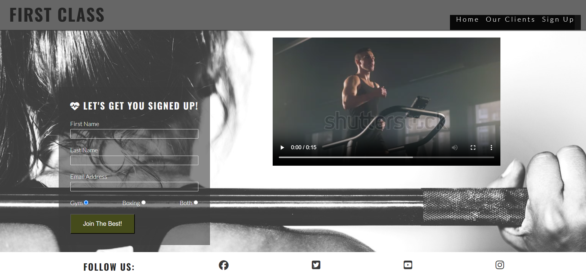

# First Class

First Class is a fictional community of people looking to get in better-shape and become a first-class individual. It is situated in the centre of London- an area that is easily accessible from many areas. The two locations of St.James Park and Hilton Hotel allows you to not just enjoy the services and training, but to also enjoy the scenery, as the locations are very developed, and filled with high quality equipment.  

The purpose of this website is to promote First Class and to provide information to the customers about the training, session times and contact options. The website targets an audience of new customers looking for the training being offered as well as returning customers looking to schedule new appointments or find out more about the benefits they receive from our training. .

Visit the deployed website [here] https://akshayjay29.github.io/self-improvement/

## Table of Contents

1. [User Experience (UX)](#user-experience-ux)
    1. [Project Goals](#project-goals)
    2. [User Stories](#user-stories)
    3. [Color Scheme](#color-scheme)
    4. [Typography](#typography)
2. [Features](#features)
    1. [General](#general)
    2. [Landing Page](#landing-page)
    3. [Our Clients Page](#our-clients-page)
    4. [Sign Up Page](#sign-up-page)
    5. [404 Error Page](#404-error-page)
 3. [Technologies Used](#technologies-used)
    1. [Languages Used](#languages-used)
    2. [Frameworks, Libraries and Programs Used](#frameworks-libraries-and-programs-used)
4. [Testing](#testing)
    1. [Testing User Stories](#testing-user-stories)
    2. [Code Validation](#code-validation)
    3. [Accessibility](#accessibility)
    4. [Tools Testing](#tools-testing)
    5. [Manual Testing](#manual-testing)
5. [Finished Product](#finished-product)
6. [Deployment](#deployment)
    1. [GitHub Pages](#github-pages)
7. [Credits](#credits)
    1. [Content](#content)
    2. [Media](#media)
    3. [Code](#code)
8. [Acknowledgements](#acknowledgements)

***

## User Experience (UX)

### Project Goals

* The website should have a sophisticated and bold design, appealing to the customers.

* Present the sessions offered and information about them in order to attract more customers.

* Provide the customer with useful contact us links that can facilitate future interaction with the business.

* Offer the customers the opportunity to sign up once they have decided to visit the business.

### User Stories

* As a customer, I want to be able to navigate the website intuitively and learn more about the benefits of joining the programme.

* As a customer, I want to be able to see any previous or current clients experiencing the benefits of the programme.

* As a customer, I want to easily find the contact information for the business.

* As a customer, I want to find social media links to the business.

* As a customer, I want to be able to sign up directly from the website.

* As a customer, I want to easily find the business' location.

### Color Scheme

The colors used in the site are two different tones of black #3a3a3a for the text in the headers and #252525 for the text in the body and rgba(0, 0, 0, 0.792) for the nav bar) different tones of grey: rgba(0, 0, 0, .6) for the background of the header and  #e6e6e6 for the shadow effect of the circle cover image. These colors are chosen to represent the boldness of our clients and are used to portray a sense of sophistication and sharpness.

### Typography

The main font used in the site is Lato, with Sans Serif as the fallback font in case Lato is not being imported correctly. Oswald is used for the headings with Sans Serif as the fallback. 

COMPLETE

[Back to top ⇧](#first-class)

## Features

### General

* Responsive design across all device sizes.

* Similar color scheme and design throughout all pages to effectively structure, categorise and present the information to the customers.

* **Header**
      
    - The header contains the business logo and fully responsive navigation bar positioned across the top of the screen.

    - The business logo functions as a link to the landing page.

    - The navigation bar is identical in all pages and contains links to all pages to facilitate navigation across the site. It also has a hover effect that changes color to provide feedback to the customer for a better user experience.

* **Footer**

    - The footer includes a title of Follow Us to improve the user experience and make it more easy to understand for the user that the logos are links to the business' social media channels. 

* **Main Image**

    - The main image is designed to attract the customer's attention and represents the typical admirable characteristics of our clients.

* **Why Join Us Section**
  

    - Contains text with information about why the business is beneficial to customers as well as an eye-catching image.
    
* **Session times Section**
  
  
  
- Contains text with information about the timings and location for each section
- Has a striking background color of grey: rgba(0, 0, 0, .6) to catch the user's attention and help persuade them to join the programme.

* **Our Clients**

-. The Our Clients page contains a range of images of successful clients in the first class community.

- Follow us links remain in the footer of this page to ensure a smooth experience for the user and influence the user to support the business on social media.

### Sign Up Page

* **Sign Up Form**
  

    - The form allows the customer to sign up to the desired programme directly from the business' website.    

- There is also a section on the page which plays a video of one of our clients training in order to give extra motivation for the customer to sign up to the programme. 

* **Background video**
  - Background video (of a client training) added into the sign up page to add extra motivation to convince the user to join the programme as they can see others working hard and pushing themselves in the programme.

[Back to top ⇧](#first-class)

## Technologies Used

### Languages Used
* [HTML5](https://en.wikipedia.org/wiki/HTML5)
* [CSS3](https://en.wikipedia.org/wiki/CSS)

### Frameworks, Libraries and Programs Used

* [Font Awesome](https://fontawesome.com/)
     - Font Awesome was used throughout all pages to add icons in order to create a better visual experience for UX purposes.

* [TinyPNG](https://tinypng.com/)
    - TinyPNG was used to reduce the file size of the images for the website.

* [GitPod](https://gitpod.io/)
     - GitPod was used for writing code, committing, and then pushing to GitHub.

* [GitHub](https://github.com/)
     - GitHub was used to store the project after pushing.

* [Am I Responsive?](http://ami.responsivedesign.is/#)
    - Am I Responsive was used in order to see responsive design throughout the process and to generate mockup imagery to be used.

* [Responsive Design Checker](https://www.responsivedesignchecker.com/)
    - Responsive Design Checker was used in the testing process to check responsiveness on various devices.

* [W3C Markup Validator](https://validator.w3.org/)
    - W3C Markup Validator was used to validate the HTML code.

* [W3C CSS Validator](https://jigsaw.w3.org/css-validator/)
    - W3C CSS Validator was used to validate the CSS code.

[Back to top ⇧](#pura-vida-spa)

## Testing

### Testing User Stories

* As a customer, I want to be able to navigate the website intuitively and learn more about the business and training being offered.

     - The website offers an intuitive structure for the customers to navigate and find the information they are looking for.

    - The navigation bar is clearly presented in all pages for the customers to find with ease and it is easily navigable.

* As a customer, I want to easily find the contact information for the business.

    - The footer contains a clear follow us section with all necessary business' contacts

* As a customer, I want to find social media links to the business.

    - The footer provides link to the business' social media channels.

* As a customer, I want to be able to sign up directly from the website.

    - The sign up page provides a form for the customer to sign up to the programme.

* As a customer, I want to easily find the business' location.

    - The home page contains a session times section which clearly provides the location for each session, as well as what time it takes takes place. 

### Code Validation

* The [W3C Markup Validator](https://validator.w3.org/) and [W3C CSS Validator](https://jigsaw.w3.org/css-validator/) services were used to validate all pages of the project in order to ensure there were no syntax errors.

    - W3C Markup Validator found an error concerning headings not being included on the main and book now images. The section tag was replaced for a div tag to correct this. 
    
    - Another error found by W3C Markup Validator was concerning a percentage value used inside the iframe tag to declare the width property on the Book Now page. The width and height properties for the iframe were declared inside the CSS file instead.

    -  W3C CSS Validator found no errors or warnings on my CSS.

### Tools Testing

* [Chrome DevTools](https://developer.chrome.com/docs/devtools/)

    - Chrome DevTools was used during the development process to test, explore and modify HTML elements and CSS styles used in the project.

### Manual Testing

* Browser Compatibility

    - The website has been tested on the following browsers:

        - **Google Chrome**
        
        No appearance, responsiveness nor functionality issues.

        - **Safari**
        
        No appearance, responsiveness nor functionality issues.

        - **Microsoft Edge**
        
        No appearance, responsiveness nor functionality issues.

* Device compatibility

    - The website has been tested on multiple devices, including:

        - **MacBook Pro 15"**

        No appearance, responsiveness nor functionality issues.

        - **Dell Latitude 5300**

        No appearance, responsiveness nor functionality issues.

        - **iPad Pro 12.9"**

        No appearance, responsiveness nor functionality issues.

        - **iPad Pro 10.5"**

        No appearance, responsiveness nor functionality issues.

        - **iPhone XR**
        
        No appearance, responsiveness nor functionality issues.

        - **iPhone 7**

        No appearance, responsiveness nor functionality issues.

* Common Elements Testing
    - All Pages
        
        - **Header**

            - Clicking on the main logo will bring the customer back to the landing page.

        - **Navigation Bar**

            - Hovering on the different navigation bar's links will trigger hover effect, highlighting the link for the customer.

            - Clicking on the navigation bar's links will bring the customer to the specified page.
        
        - **Footer**
        
- Clicking on the social media links will open the specific website on a new tab.

 - Our Clients Page
 - 
        - Range of pictures of clients in the gym, all from different ethnic backgrounds which will help any customer feel like they are already welcomed into the programme.  

        - Clicking on the book button link on each treatment section will bring the customer to the book now page.

    - Sign Up Page

        - When filling out the sign up form, the customer is required to complete all fields before submitting. 
        
        - Controls given to customer to help them control the background video in the sign up page
     
        - The hover effect on each section of the sign up form will help the customer navigate their way through the form. 

    - 404 Error Page

        - Entering an incorrect address into the address bar will bring the customer back to the 404 error page.

        - Hovering on the homepage link will trigger hover effect, increasing the font size of the link's text.

        - Clicking on the homepage link will bring the customer back to the landing page.

[Back to top ⇧](#first-class)

## Deployment

* This website was developed using [GitPod](https://www.gitpod.io/), which was then committed and pushed to GitHub using the GitPod terminal.

### GitHub Pages

* Here are the steps to deploy this website to GitHub Pages from its GitHub repository:

    1. Log in to GitHub and locate the [GitHub Repository](https://github.com/).

    2. At the top of the Repository, locate the Settings button on the menu.

        - Alternatively click [here](https://raw.githubusercontent.com/) for a GIF demostration of the process.

    3. Scroll down the Settings page until you locate the Pages section.

    4. Under Source, click the dropdown called None and select Master Branch.

    5. The page will refresh automatically and generate a link to your website.

[Back to top ⇧](#first-class)

## Credits 

### Content

- All content was written by the developer.

[Back to top ⇧](#first-class)

## Acknowledgement

* My family, for their constructive opinions and critics during the design and development process. 

* My tutor, Marcel, for his constant feedback and guidance.

* Code Institute and its amazing Slack community for their support and providing me with advice for completing this project.

* Student Care team, for being supportive, and providing consistent feedback, over the very unfortunate circumstance I faced during the completion of this project. 

[Back to top ⇧](#first-class)
